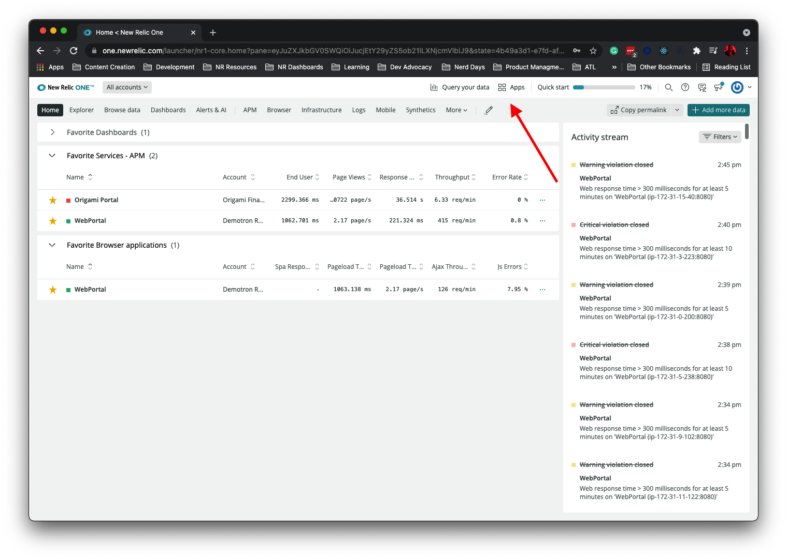

# Welcome!

You can set up your environment to build [New Relic One applications](https://docs.newrelic.com/docs/new-relic-programmable-platform-introduction) in three steps. By the end of this guide, you'll have a local server with an established connection to the New Relic One platform, where you can see changes to your app in real time. Enjoy!

## Setting up your environment

1. In your browser, go to [New Relic One](https://one.newrelic.com/) and follow the instructions to [**Build your own application**](https://one.newrelic.com/launcher/developer-center.launcher#pane=eyJuZXJkbGV0SWQiOiJkZXZlbG9wZXItY2VudGVyLmRldmVsb3Blci1jZW50ZXIifQ==).

> **Important!** Some customers have enterprise-wide agreements with New Relic, prohibiting employees from accepting the Terms and Conditions of the developer program. Those persons will be unable to download the CLI. If you're effected by this, please reach out to your legal department and/or contact your New Relic sales representative to explore alternatives for becoming familiar with this material while honoring your company's employee policies.

2. Clone the workshop repo:

```bash
# if you haven't cloned the workshop repo already
git clone https://github.com/newrelic/nr1-workshop.git
```

> **Note:** Each exercise exists as a folder in this repository. Following the material will involve four steps:
>
> 1. Navigating to the exercise's directory
> 2. Running `npm install`
> 3. Running `nr1 nerdpack:serve` to stand up a local server
> 4. Following the _INSTRUCTIONS.md_ in the given folder

3. Start the `setup` Nerdpack:

```bash
cd nr1-workshop/setup
npm install
nr1 nerdpack:uuid -gf
nr1 nerdpack:serve
```

Your terminal output should look like the following:


Congratulations! You are now set up for building New Relic One applications. Learn how to view your Setup Exercise application in the next section.

## Viewing your app

1. Open your browser to [New Relic One with local NerdPacks](https://one.newrelic.com?nerdpacks=local) (this places locally served applications in New Relic One) and navigate to Apps:



2. Click on the "Setup Exercise" launcher. You should see the following:


Great. Now, you are ready to [get started.](https://github.com/newrelic/nr1-workshop)
